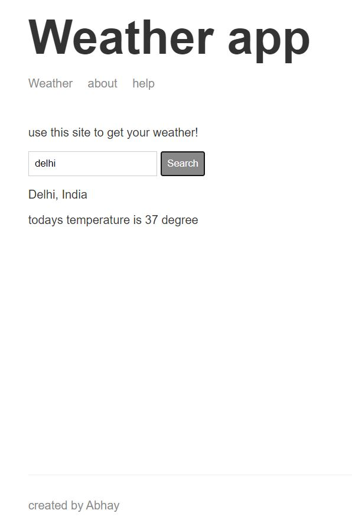

# Weather-website

This is a dynamic website made for weather details using WeatherStack and MapBox APIs.

## Technologies used

* NodeJS
* MongoDB
* Handlebars
* ExpressJS

## Screenshot

## Live Demo
http://weather-website.herokuapp.com/
